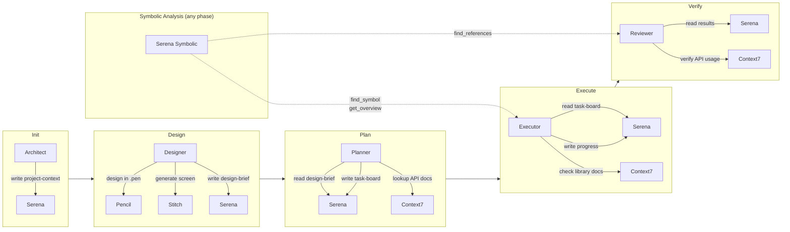

# MCP Integration Protocol

## Overview

Nexus uses 5 MCP servers throughout the project lifecycle:

| MCP Server | Purpose | When Used |
|-----------|---------|-----------|
| **Serena** | Memory, symbolic code analysis, thinking tools, mode switching | Every workflow |
| **Context7** | Library docs lookup, version-specific API reference | Plan, Execute, Debug |
| **Pencil** | Design inspiration + visual mockup, design↔code sync, .pen files | Design phase (BẮT BUỘC) |
| **Stitch** | AI screen generation, rapid visual prototyping | Design phase (BẮT BUỘC) |
| **ck** | Semantic code search — tìm code theo ý nghĩa, không chỉ keyword | Plan, Execute, Verify, Review |

---

## 1. Serena Memory — Inter-Agent Communication

### Tools

| Tool | Usage |
|------|-------|
| `read_memory("file.md")` | Read shared memory file |
| `write_memory("file.md", content)` | Create/overwrite memory |
| `edit_memory("file.md", edits)` | Modify existing memory |
| `list_memories()` | List all memory files |
| `delete_memory("file.md")` | Remove temp memory |

### Usage per Workflow

| Workflow | Serena Memory Usage |
|----------|-------------------|
| `/nexus:init` | `write_memory("project-context.md")` — store project vision for all agents |
| `/nexus:design` | `write_memory("design-brief.md")` — Designer → Planner handoff |
| `/nexus:plan` | `read_memory("design-brief.md")` → create plans → `write_memory("task-board.md")` |
| `/nexus:execute` | `read_memory("task-board.md")` → execute → `write_memory("progress-executor.md")` per wave |
| `/nexus:verify` | `read_memory("results-{phase}-{wave}.md")` → verify → `write_memory("verification-report.md")` |
| `/nexus:review` | `read_memory("verification-report.md")` → review → `write_memory("review-findings.md")` |
| Session end | `write_memory("handover.md")` — context for next session |

> **Standard Memory Files & Schemas**: Xem `.agent/orchestration/memory-schema.md`
> **Memory Rules & Types**: Xem `_shared/memory-protocol.md`

---

## 2. Context7 — Library Documentation Lookup

### Tools

| Tool | Usage |
|------|-------|
| `resolve-library-id("react")` | Find Context7 ID for a library |
| `query-docs(id, topic)` | Get up-to-date docs + code examples |

### Usage per Workflow

| Workflow | Context7 Usage |
|----------|---------------|
| `/nexus:plan` | Planner looks up API patterns before creating plan steps |
| `/nexus:execute` | Executor checks current API docs before writing code |
| `/nexus:execute` (debug) | Debugger verifies API usage is correct for library version |
| `/nexus:verify` | Reviewer checks if code follows latest API best practices |

### When to Call Context7

```
Before writing code that uses an external library:
1. resolve-library-id("library-name") → get ID
2. query-docs(ID, "specific-topic") → get current API
3. Use the returned docs as reference for implementation
```

### Example

```
# Executor needs to use React Query in a component
1. resolve-library-id("tanstack-react-query") → "tanstack/react-query"
2. query-docs("tanstack/react-query", "useQuery hook") → Returns:
   - Current API signature
   - Working code example
   - Breaking changes from v4→v5
3. Executor writes code based on returned docs (not training data)
```

### Auto-Invoke Rule

Context7 should be called automatically when:
- Task involves a library not in core language stdlib
- Library version is specified in `package.json` / `requirements.txt`
- Agent writes import statements for external packages

### Enforcement Rules (v3.3)

> Từ Nexus v3.3, Context7 **không còn chỉ khuyến nghị** — nó là hard requirement cho external libraries.

**3 cấp độ:**

| Cấp | Khi nào | Hành vi |
|-----|---------|---------|
| 🔴 **BẮT BUỘC** | Framework chính (FastAPI, React, Tauri...), thư viện API phức tạp, version-specific | PHẢI gọi Context7 TRƯỚC khi code. Không gọi = plan bị reject / code bị flag |
| 🟡 **KHUYẾN NGHỊ MẠNH** | Utility có API riêng (openpyxl, docxtpl...), breaking changes possible | NÊN gọi. Bỏ qua cần ghi lý do |
| 🔵 **OPTIONAL** | Thư viện đơn giản, ít API (icons, multipart...) | Gọi nếu cần. Không gọi = OK |

**Compliance tracking:**

Mỗi lần gọi Context7, PHẢI ghi vào 2 nơi:
1. **Plan file** → `<context7-checklist>` section
2. **Usage log** → `MCP Tools` field: `context7 ({library}: {query summary})`

**Nếu Context7 unavailable:**
- Ghi `⚠️ Context7 N/A, used training data for {library}` vào cả plan và usage log
- Agent dùng training data nhưng PHẢI ghi note rõ ràng — reviewer cần biết để double-check

**Verify checkpoint:**
- `/verify` Step 3.5 sẽ **tự động kiểm tra** compliance score bằng cách cross-reference dependencies vs context7 entries
- Score < 50% = FAIL advisory cho user

---

## 3. Pencil — IDE-Native Vector Design Tool

### Tools

| Tool | Usage |
|------|-------|
| `batch_design(ops)` | Tạo/sửa/xóa design elements (insert, copy, update, replace, move, delete) |
| `batch_get(patterns)` | Đọc components, search by patterns, inspect hierarchy |
| `get_screenshot(nodeId)` | Render preview image của node/frame |
| `snapshot_layout(parentId)` | Phân tích layout, detect overlap/spacing issues |
| `get_variables()` | Đọc design tokens (colors, fonts, spacing) |
| `set_variables(vars)` | Cập nhật design tokens — sync với CSS variables |
| `get_editor_state()` | Lấy context editor hiện tại, selection, active file |
| `export_nodes(nodeIds, format)` | Export nodes sang PNG/JPEG/WEBP/PDF |
| `get_guidelines(topic)` | Lấy design guidelines cho topic cụ thể |
| `get_style_guide(tags)` | Lấy style guide cho design inspiration |

### Usage in Design Workflow

Pencil đóng **2 vai trò** trong design workflow:

**Vai trò 1: Gợi ý Design (Inspiration)**

| Step | Pencil Tool | Purpose |
|------|-------------|--------|
| Foundation | `get_style_guide(tags)` | Visual style inspiration |
| Foundation | `get_guidelines("web-app"/"mobile-app"/"landing-page")` | Layout best practices |
| Screen Design | `get_guidelines(topic)` | Layout suggestions per screen type |

**Vai trò 2: Tạo Mockup (Visual)**

| Step | Pencil Tool | Purpose |
|------|-------------|--------|
| Foundation | `batch_design(ops)` | Direction mockups, visual foundation |
| Foundation | `set_variables(vars)` | Sync design tokens vào .pen |
| Wireframing | `batch_design(ops)` | Wireframe per screen |
| Component Design | `batch_design(ops)` | Component library (reusable) |
| Full Mockup | `batch_design(ops)` | Full-fidelity mockups |
| Validation | `snapshot_layout(parentId)` | Detect overlap, spacing issues |
| Review | `get_screenshot(nodeId)` | Render preview cho user review |
| Handoff | `export_nodes(nodeIds, format)` | Export design images |
| Design→Code | AI reads `.pen` → Context7 verify APIs → generates code |

### Pencil + Context7 Cross-Reference (BẮT BUỘC khi Design→Code)

> Khi generate code từ `.pen` file, **PHẢI** cross-reference với Context7 để đảm bảo code output dùng đúng API version.

Quy trình: `batch_get()` → `resolve-library-id()` → `query-docs()` → verify API → generate code.

### When Pencil is Not Available

> **`/design` workflow**: Pencil là BẮT BUỘC. Nếu Pencil không khả dụng → **DỮNG workflow**, thông báo user kiểm tra và sửa Pencil MCP. KHÔNG tự mockup bằng HTML/image.
>
> **Các workflow khác** (execute, review): Fall back to text-based analysis nếu cần.

### Path Normalization (Windows — BẮT BUỘC)

Tất cả paths từ Pencil tools (`export_nodes`, `get_screenshot`) PHẢI normalize `\` → `/` trước khi embed vào markdown.

```
❌ 
✅ 
```

---

## 4. Stitch MCP — AI Screen Generation

### Overview

Stitch MCP generates UI screens directly from text prompts using AI. It acts as one of the 4 design proposal engines in the `/design` workflow.

### Tools

| Tool | Usage |
|------|-------|
| `create_project(title)` | Tạo project mới cho design exploration |
| `generate_screen_from_text(projectId, prompt)` | AI-generate screen từ text prompt |
| `get_screen(projectId, screenId)` | Lấy chi tiết screen đã generate |
| `list_screens(projectId)` | Liệt kê screens trong project |
| `edit_screens(projectId, screenIds, prompt)` | Chỉnh sửa screens đã generate |
| `generate_variants(projectId, screenIds, prompt)` | Tạo biến thể của screen |
| `list_projects()` | Liệt kê tất cả projects |
| `get_project(name)` | Lấy chi tiết project |

### Usage in Design Workflow

| Step | Stitch Tool | Purpose |
|------|-------------|--------|
| MCP Readiness (Step 0.2) | `list_projects()` | Kiểm tra Stitch availability |
| Proposal C (Stage 1.2) | `create_project()` | Tạo project cho design direction |
| Proposal C (Stage 1.2) | `generate_screen_from_text()` | AI-generate screen prototype |
| Proposal C (Stage 1.2) | `get_screen()` | Lấy kết quả để phân tích |

### Availability

- Stitch là **BẮT BUỘC** trong design workflow — cần cho Proposal C
- Nếu Stitch không khả dụng → **DỪNG workflow**, yêu cầu sửa Stitch MCP
- Stitch output được chuyển thành Pencil visual preview card để so sánh đồng nhất

---

## 5. Serena Symbolic Tools — Code Analysis & Editing

### Overview

Beyond memory, Serena provides **semantic code analysis** tools powered by Language Server Protocol (LSP). These tools operate at the **symbol level** (classes, methods, functions) instead of raw text, significantly improving token efficiency and edit precision.

> If Serena is not available or not activated, agents fall back to standard file-based code reading and editing (grep, file read, text replace).

### Tools

| Tool | Purpose | Example |
|------|---------|---------|
| `find_symbol(pattern)` | Find symbol by name/path | `find_symbol("UserService/create")` |
| `find_referencing_symbols(symbol)` | Find all references to a symbol | `find_referencing_symbols("handleLogin")` |
| `get_symbols_overview(file)` | Get high-level overview of symbols in a file | `get_symbols_overview("src/auth.ts")` |
| `rename_symbol(symbol, new_name)` | Rename symbol throughout codebase | `rename_symbol("oldName", "newName")` |
| `replace_symbol_body(symbol, body)` | Replace full definition of a symbol | `replace_symbol_body("MyClass/method", new_code)` |
| `insert_after_symbol(symbol, content)` | Insert code after a symbol | `insert_after_symbol("lastImport", new_import)` |
| `insert_before_symbol(symbol, content)` | Insert code before a symbol | `insert_before_symbol("MyClass", decorator)` |
| `search_for_pattern(regex)` | Flexible regex search across codebase | `search_for_pattern("TODO.*fixme")` |

### Usage per Workflow

| Workflow | Symbolic Tools Usage |
|----------|---------------------|
| `/nexus:init` | `get_symbols_overview()` — scan existing codebase structure during research step |
| `/nexus:plan` | `find_symbol()`, `search_for_pattern()` — research existing code before creating plans |
| `/nexus:execute` | `find_symbol()`, `replace_symbol_body()`, `insert_after_symbol()` — precise code editing |
| `/nexus:verify` | `find_referencing_symbols()` — check for breaking changes across codebase |
| `/nexus:review` | `get_symbols_overview()`, `find_referencing_symbols()` — analyze code quality at symbol level |
| `/nexus:quick` (debug) | `find_symbol()`, `find_referencing_symbols()` — trace bugs through call stack |

### When to Use Symbolic Tools vs File-Based

| Scenario | Use Symbolic Tools | Use File-Based |
|----------|:------------------:|:--------------:|
| Edit a specific method | ✅ `replace_symbol_body` | ❌ Error-prone regex |
| Find all callers of a function | ✅ `find_referencing_symbols` | ❌ Grep may miss dynamic calls |
| Understand file structure | ✅ `get_symbols_overview` | ❌ Must read entire file |
| Rename across codebase | ✅ `rename_symbol` | ❌ Manual find-replace |
| Edit non-code files (config, docs) | ❌ Not applicable | ✅ Direct file edit |
| Codebase not indexed by Serena | ❌ Not available | ✅ Always works |

### Token Efficiency

Symbolic tools reduce context usage by **3-5x**:
- `get_symbols_overview()` returns ~50 tokens vs reading file (~500+ tokens)
- `find_symbol(name, include_body=True)` returns only the method body (~100 tokens) vs entire file
- `find_referencing_symbols()` returns precise locations vs grep output with false positives

---

## 7. Serena Mode Switching — Workflow Optimization

### Overview

Serena supports runtime mode switching via `switch_modes`. Modes adjust Serena's prompt and toolset for different task types. Nexus workflows can leverage this to optimize agent behavior per phase.

### Nexus Workflow → Serena Mode Mapping

| Nexus Workflow | Serena Modes | Rationale |
|---------------|-------------|-----------|
| `/nexus:init` | `interactive`, `editing` | Research + create project files |
| `/nexus:design` | `interactive` | Dialog-heavy design review |
| `/nexus:plan` | `planning`, `interactive` | Analysis + user approval |
| `/nexus:execute` | `editing`, `interactive` | Code modification as primary task |
| `/nexus:verify` | `planning`, `interactive` | Analysis + user sign-off |
| `/nexus:review` | `planning` | Analysis focus, minimal editing |
| `/nexus:quick` | `editing`, `interactive` | Quick fix with user dialog |

### How to Use

At the **start** of each workflow, call:
```
switch_modes(["planning", "interactive"])  # example for /plan
```

Rules:
1. Each workflow **self-sets** its modes — never rely on previous workflow's mode state
2. `interactive` should almost always be included (user dialog is core to Nexus)
3. Mode switch is **optional** — if `switch_modes` fails, workflow continues normally
4. Default Serena modes (`interactive` + `editing`) are a safe fallback for any workflow

### Available Modes

| Mode | Effect |
|------|--------|
| `planning` | Focus on analysis, reduces editing tools |
| `editing` | Full code modification capabilities |
| `interactive` | Back-and-forth dialog, clarification prompts |
| `one-shot` | Single comprehensive response (for reports) |
| `no-onboarding` | Skip onboarding check |
| `no-memories` | Disable memory tools entirely |

> Mode switching is available in the `ide` context used by Antigravity.

---

## 6. ck — Semantic Code Search (v3.6.1)

### Overview

`ck` (seek) tìm code theo **ý nghĩa**, không chỉ keyword. Search "error handling" → tìm try/catch, error returns, exception handling dù code không chứa từ này. Local-first, không cần API key.

> Bổ sung cho Serena (symbolic/exact) và grep (text/regex). ck là **OPTIONAL** — tất cả workflows hoạt động bình thường không có ck.

### Tools

| Tool | Purpose | Example |
|------|---------|---------|
| `semantic_search(query, path)` | Tìm code theo ý nghĩa dùng embeddings | `semantic_search("authentication logic")` |
| `regex_search(pattern, path)` | Grep-style pattern matching | `regex_search("TODO.*fixme")` |
| `hybrid_search(query, path)` | Kết hợp semantic + keyword (Reciprocal Rank Fusion) | `hybrid_search("async timeout")` |
| `index_status(path)` | Kiểm tra trạng thái index | `index_status("./src")` |
| `reindex(path)` | Force rebuild search index | `reindex("./")` |
| `health_check()` | Server status và diagnostics | `health_check()` |

### Usage per Workflow

| Workflow | ck Usage |
|----------|----------|
| `/nexus:plan` | `semantic_search("similar to REQ-xxx feature")` — tìm code patterns tương tự đã có trong codebase |
| `/nexus:execute` | `hybrid_search("existing implementation of X")` — tìm code có sẵn trước khi viết mới |
| `/nexus:verify` | `semantic_search("breaks interface")` — detect breakage ngoài scope grep |
| `/nexus:review` | `semantic_search("security vulnerability pattern")` — semantic security scan |
| `/nexus:quick` | `hybrid_search("bug cause")` — tìm root cause nhanh hơn grep |

### When to Use ck vs Serena vs grep

| Scenario | ck | Serena | grep |
|----------|:--:|:------:|:----:|
| Tìm code theo ý nghĩa/khái niệm | ✅ Best | ❌ | ❌ |
| Tìm symbol chính xác theo tên | ❌ | ✅ Best | ✅ OK |
| Find all references to a function | ❌ | ✅ Best | ✅ OK |
| Tìm code patterns liên quan (đồng nghĩa) | ✅ Best | ❌ | ❌ |
| Rename/refactor symbol | ❌ | ✅ Best | ❌ |
| Search non-code files (docs, config) | ✅ OK | ❌ | ✅ Best |

### Configuration

**Cài đặt:**
```bash
# Cài qua Cargo
cargo install ck-search
```

**MCP Server:**
```json
{
  "ck": {
    "command": "ck",
    "args": ["--serve"],
    "cwd": "/path/to/codebase"
  }
}
```

### Performance

- Index: ~1M LOC < 2 phút
- Search: < 500ms
- Delta indexing: 80-90% cache hit (chỉ re-embed chunks thay đổi)
- Index size: ~2x source code

> **Khi ck không khả dụng**: Fall back to Serena `search_for_pattern()` + Antigravity `grep_search`. Không block workflow.

---

## MCP Configuration (for Antigravity IDE)

Add to `~/.gemini/antigravity/mcp_config.json`:

```json
{
  "mcpServers": {
    "serena": {
      "command": "uvx",
      "args": [
        "--from", "git+https://github.com/oraios/serena",
        "serena", "start-mcp-server",
        "--context", "ide"
      ],
      "disabled": false
    },
    "context7": {
      "command": "npx",
      "args": [
        "-y", "@upstash/context7-mcp",
        "--api-key", "YOUR_CONTEXT7_API_KEY"
      ],
      "disabled": false
    },
    "pencil": {
      "command": "PATH_TO_PENCIL_MCP_SERVER",
      "args": [
        "--app", "antigravity"
      ],
      "env": {}
    },
    "ck": {
      "command": "ck",
      "args": ["--serve"],
      "cwd": "PROJECT_ROOT_PATH",
      "disabled": false
    }
  }
}
```

### Serena Activation Note

Antigravity does **not** support passing working directory in MCP config. After starting Antigravity in a project directory, prompt once:

> "Activate the current project using serena's activation tool"

All subsequent chat sessions will reuse the same Serena session.

**⚠️ Re-activation sau `/init`**: Nếu Serena được activate trước `/init`, Serena chỉ nhận diện ngôn ngữ framework (Python). Workflow `/init` Step 1.3 sẽ tự động re-activate Serena sau khi tech stack thực tế đã xác định, đảm bảo symbolic tools hoạt động đúng cho ngôn ngữ dự án (Dart, TypeScript, etc.).

### Tool Names

| MCP | Category | Tools Available |
|-----|----------|-----------------|
| Serena | Memory | `read_memory`, `write_memory`, `edit_memory`, `list_memories`, `delete_memory` |
| Serena | Symbolic | `find_symbol`, `find_referencing_symbols`, `get_symbols_overview`, `rename_symbol`, `replace_symbol_body`, `insert_after_symbol`, `insert_before_symbol`, `search_for_pattern` |
| Serena | Modes | `switch_modes` |
| Context7 | Docs | `resolve-library-id`, `query-docs` |
| Pencil | Design | `batch_design`, `batch_get`, `get_screenshot`, `snapshot_layout`, `get_variables`, `set_variables`, `get_editor_state`, `get_guidelines`, `get_style_guide`, `export_nodes` |
| Stitch | Design | `create_project`, `generate_screen_from_text`, `get_screen`, `list_screens`, `edit_screens`, `generate_variants`, `list_projects`, `get_project` |
| ck | Semantic Search | `semantic_search`, `regex_search`, `hybrid_search`, `index_status`, `reindex`, `health_check` |

---

## Lifecycle Summary with MCP


